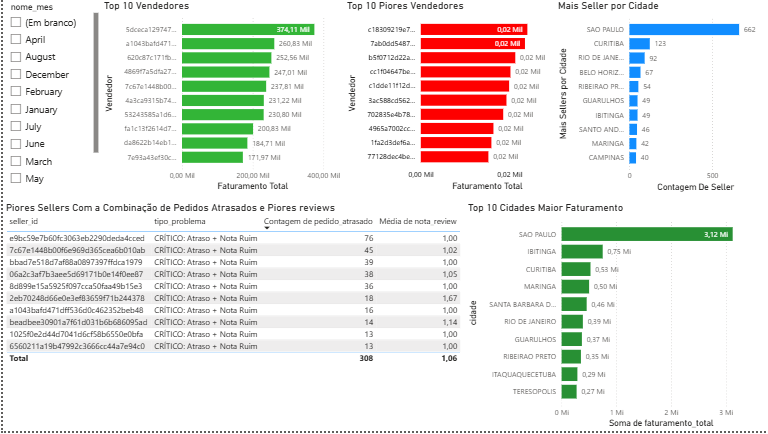

# Pipeline de Dados Olist — Diagnóstico de Saúde de Sellers

Este projeto constrói um data mart em Snowflake Schema a partir do dataset público da Olist, focado em diagnóstico de saúde de sellers. A modelagem foi orientada por perguntas reais de operação: quem fatura mais/menos, quais sellers combinam atraso com notas ruins e quais cidades concentram mais sellers e maior faturamento.

Ao longo do desenvolvimento, utilizei assistência de IA como ferramenta de apoio em engenharia de dados: identificação de deduplicações e anomalias, revisão de integridade entre camadas (Bronze → Silver → Data Mart) e suporte na definição de métricas de negócio. A IA foi usada para aumentar produtividade e agilizar processos de ingestão e modelagem, mas todas as decisões de design, regras de negócio e SQL foram revisadas e implementadas manualmente.

---

## Dashboard — Visão Geral

---

## Visão geral

Este projeto define e implementa um **data mart de operações de sellers** (SELLER_OPS_MART) em cima do dataset público da Olist.

O objetivo não é modelar "todo" o data warehouse da Olist, mas criar um recorte específico que atenda ao time de operações e qualidade de sellers, usando **snowflake schema** para representar hierarquias de localização e categorias de produtos.

---

## Problema de negócio

A Olist depende da performance dos sellers para manter a experiência do cliente. Alguns vendedores atrasam entregas, concentram reclamações e derrubam a nota média da plataforma.

Este mart responde às perguntas:

- Quais sellers são de alto risco para a plataforma?
- Em quais regiões esses sellers estão concentrados?
- Quais categorias de produto estão mais associadas a atraso e baixa satisfação?

O consumidor direto desse mart é o time de **Seller Operations** (operações e qualidade), que precisa decidir quem treinar, monitorar ou eventualmente desligar.

---

## Dataset de origem

Fonte principal: **Brazilian E-Commerce Public Dataset by Olist (Kaggle)**.

Tabelas relevantes do warehouse lógico:

- `orders` — status, datas de compra, aprovação, envio e entrega
- `order_items` — itens por pedido, `seller_id`, preço, frete
- `order_reviews` — notas (1–5) e comentários
- `order_payments` — forma de pagamento, parcelas
- `sellers` — localização do seller (cidade, estado)
- `customers` — localização do cliente
- `products` — categoria, dimensões
- `product_category_translation` — tradução de categorias
- `geolocation` — CEP, latitude, longitude

Esse mart assume que essas tabelas já existem na camada silver/gold do warehouse principal.

---

## Escopo do data mart

O **SELLER_OPS_MART** é definido por:

### Fatos centrais

- `F_SELLER_ORDERS` — pedidos por seller, com métricas de atraso e valor.
- `F_SELLER_REVIEWS` — avaliações de clientes agregadas por pedido e seller.

### Dimensões em snowflake

- `DIM_SELLER`
  - `DIM_SELLER_LOCATION` (subdimensão)
- `DIM_PRODUCT`
  - `DIM_PRODUCT_CATEGORY` (subdimensão)
- `DIM_TIME`

O foco é operacional: métricas e dimensões suficientes para acompanhar saúde de seller ao longo do tempo e por região/categoria.

---

## Snowflake schema — desenho lógico

### Fato: F_SELLER_ORDERS

**Grão:** 1 linha por pedido entregue.

Colunas principais:

- `order_id` — identificador do pedido.
- `seller_id` — chave do seller.
- `product_id` — produto principal.
- `customer_id` — cliente.
- `time_id` — chave da dimensão de tempo.
- `seller_location_id` — chave da subdimensão de localização.
- `product_category_id` — chave da subdimensão de categoria.
- `order_status` — status (apenas entregues neste mart).
- `order_purchase_timestamp` — data/hora de compra.
- `order_delivered_customer_date` — data/hora de entrega.
- `order_estimated_delivery_date` — data estimada.
- `dias_atraso` — diferença (entrega real − entrega estimada).
- `atrasou` — booleano (dias_atraso > 0).
- `valor_pedido` — preço + frete.

### Fato: F_SELLER_REVIEWS

**Grão:** 1 linha por review ligado a pedido e seller.

Colunas principais:

- `review_id`.
- `order_id`.
- `seller_id`.
- `time_id` — data da criação da review.
- `review_score` — nota (1–5).
- `review_comment_title`.
- `review_comment_message`.

---

### Dimensão: DIM_SELLER

- `seller_id`.
- `seller_location_id` — FK para `DIM_SELLER_LOCATION`.
- `seller_since` — data do primeiro pedido.
- `seller_status` — ativo/inativo.

### Subdimensão: DIM_SELLER_LOCATION

- `seller_location_id`.
- `seller_zip_code_prefix`.
- `seller_city`.
- `seller_state`.
- `seller_region` — derivado de estado (ex.: Sudeste, Sul, Nordeste).

Hierarquia: **região → estado → cidade**.

---

### Dimensão: DIM_PRODUCT

- `product_id`.
- `product_category_id` — FK para `DIM_PRODUCT_CATEGORY`.
- `product_weight_g`.
- `product_length_cm`.
- `product_height_cm`.
- `product_width_cm`.

### Subdimensão: DIM_PRODUCT_CATEGORY

- `product_category_id`.
- `product_category_name` (PT).
- `product_category_name_english` (EN).
- `category_group` — agrupamento de categorias em grupos maiores (ex.: eletro, moda, lar).

Hierarquia: **grupo → categoria**.

---

### Dimensão: DIM_TIME

- `time_id`.
- `date`.
- `day_of_week`.
- `month`.
- `quarter`.
- `year`.

Usada por ambos os fatos para análises temporais.

---

## Métricas principais do mart

A partir dos fatos e dimensões, este mart suporta métricas como:

- `total_pedidos` — contagem de pedidos por seller.
- `taxa_atraso` — % de pedidos atrasados por seller.
- `atraso_medio_dias` — média de dias de atraso.
- `nota_media` — média de `review_score`.
- `pct_notas_baixas` — % de reviews com score ≤ 2.
- `volume_por_categoria` — número de pedidos por `product_category_id`.
- `volume_por_regiao` — número de pedidos por `seller_region`.

Essas métricas podem ser materializadas em uma tabela agregada `AGG_SELLER_HEALTH` dentro do próprio mart.

---

## Data product — contrato de dados

Este data mart é tratado como um **data product de Seller Operations**.

### 1. Schema estável

- Fatos e dimensões com colunas documentadas.
- Chaves primárias e estrangeiras definidas.
- Tipos de dados consistentes (datas, numéricos, IDs).

### 2. Qualidade mínima

Regras de qualidade obrigatórias:

- Nenhum registro em `F_SELLER_ORDERS` sem `seller_id` nem `time_id`.
- Nenhum registro em `F_SELLER_ORDERS` com `order_status` diferente de *delivered*.
- `review_score` sempre entre 1 e 5 quando presente.
- `dias_atraso` calculado apenas para pedidos entregues.
- `DIM_SELLER_LOCATION` sempre preenchida para sellers ativos.

Falhas nessas regras devem ser reportadas em um log de qualidade.

### 3. Frequência de atualização

- Atualização diária ou semanal, dependendo da disponibilidade de dados.
- Snapshot de métricas agregadas (`AGG_SELLER_HEALTH`) com carimbo de data.

### 4. Consumidores

- Dashboards de operações (monitoramento de sellers).
- Análises ad‑hoc de times de dados.
- Modelos preditivos de risco de seller.

---

## Integração com medallion e warehouse

Este mart se apoia em uma arquitetura medallion já existente:

- **Bronze**: CSVs originais do Olist (dados crus).
- **Silver**: tabelas normalizadas e limpas (orders, items, reviews, sellers, etc.).
- **Gold**: data products como o **SELLER_OPS_MART**, cada um com seu próprio contrato.

O SELLER_OPS_MART consome dados da camada silver/gold do warehouse, mas tem suas próprias tabelas de fato e dimensão, desenhadas para o domínio de operations.

---

## Diferença em relação a um star schema simples

Um **star schema** colocaria localização e categoria diretamente em `DIM_SELLER` e `DIM_PRODUCT`, com menos normalização e sem subdimensões.

Aqui, o **snowflake schema**:

- Separa localização e categoria em subdimensões próprias.
- Representa melhor hierarquias (região, grupo de categoria).
- Facilita reuso dessas dimensões em outros marts (ex.: logística, marketing).

**Custo:** mais joins e consultas um pouco mais complexas.  
**Ganho:** modelo mais expressivo, mais fácil de evoluir e de manter consistência em múltiplos data marts.

---

## Como implementar (visão de alto nível)

1. Criar as tabelas de `DIM_*` e `F_*` no warehouse (Snowflake, DuckDB, etc.).
2. Popular dimensões a partir das tabelas silver já existentes.
3. Construir os fatos `F_SELLER_ORDERS` e `F_SELLER_REVIEWS` via joins das tabelas silver.
4. Implementar regras de qualidade e validar o contrato de dados.
5. Construir agregações como `AGG_SELLER_HEALTH` para consumo rápido.

---

## Mentalidade

Este README não é sobre "fazer mais tabelas".

É sobre aprender a pensar em termos de **domínios de dados, contratos e modelos que resistem à mudança**, subindo do nível "tabelas soltas" para "data products".
